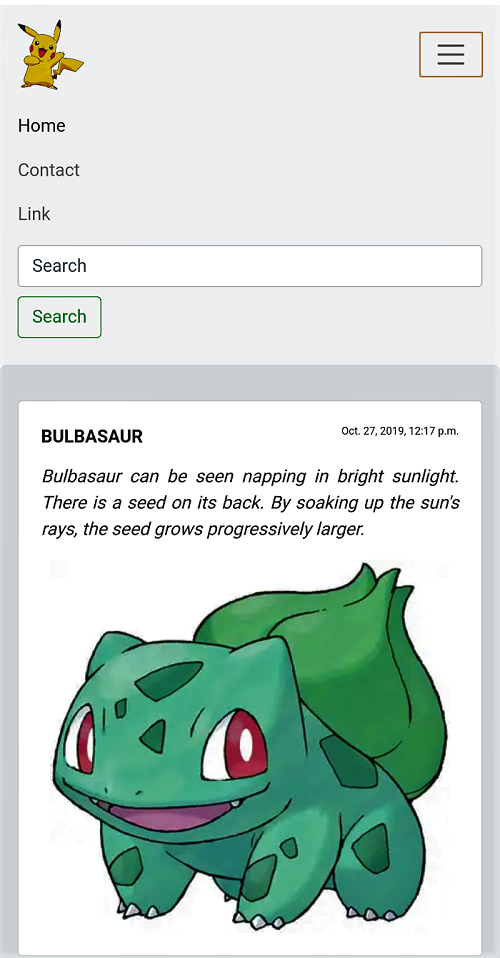
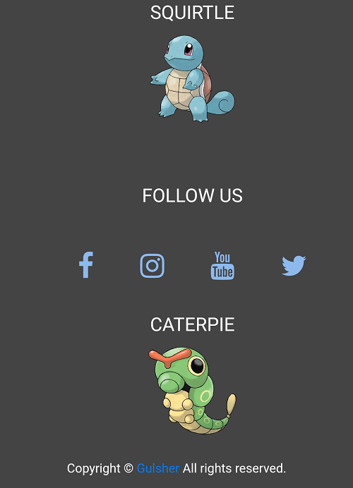

# NotifyApp_Django
<h3 style="color: red"><i>This is my simple blog post WebApp </i></h3>
<ol>
   <li>Highlights of this WebApp</li>
      <ol type="i">
         <li>I used <strong>Bootstrap 4</strong> to make webApp fully responsive</li>
         <li>you can easily post blog from database and show to the html page example title, descrption and also a images.</li>
         <li>user or visitor of the app can easily contact through the form to the admin or owner to the website</li>
   </ul>
</ul>
<h2> Some Screenshort of WebApp</h2>

<h2> Footer of this WebApp /h2>

