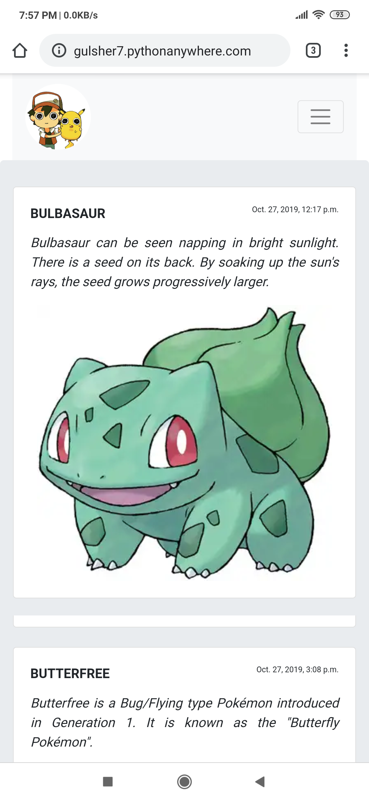

# NotifyApp_Django
<i>This is my simple blog post WebApp </i>
<ol>
   <li>Highlights of this WebApp</li>
      <ol type="i">
         <li>I used <strong>Bootstrap 4</strong> to make webApp fully responsive</li>
         <li>you can easily post blog from database and show to the html page example title, descrption and also a images.</li>
         <li>user or visitor of the app can easily contact through the form to the admin or owner to the website<li>
   </ul>
</ul>
<h1>This is some screenshort of WebApp</h1>

<h3>This is footer</h3>

