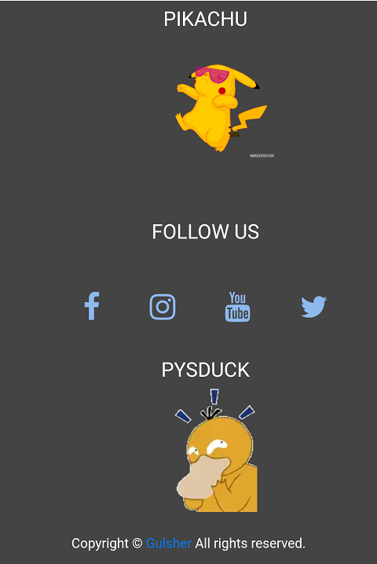

# NotifyApp_Django
<h2>This is Open Source weBApp</h2> 
<h3><i>It is simple blog post WebApp </i></h3>
<ol>
   <strong><li>Highlights of this WebApp</li></strong>
      <ol type="i">
         <li>I used <strong>Bootstrap 4</strong> to make webApp fully responsive</li>
         <li>you can easily post blog from database and show to the html page. For example:-   
            Title, Descrption and also a images.</li>
         <li>user or visitor of the app can easily contact through the form to the admin or owner to the website</li>
   </ul>
</ul>
<h1> Some Screenshort of WebApp</h1>

  

<h1> Footer of this WebApp </h1>

