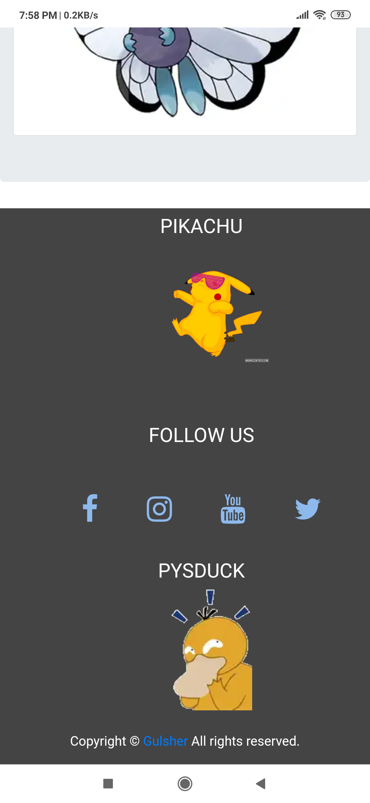

# NotifyApp_Django
-This is my simple blog post WebApp 
- Highlights of this WebApp
   1. Post
   2. Contact
    In Post modle owner of the app or admin can post a blog from database like title, description and also a images. 
    In Contact form user can send a message to admin/owner's app.

<h1>This is some screenshort of WebApp</h1>

<h3>This is footer</h3>

